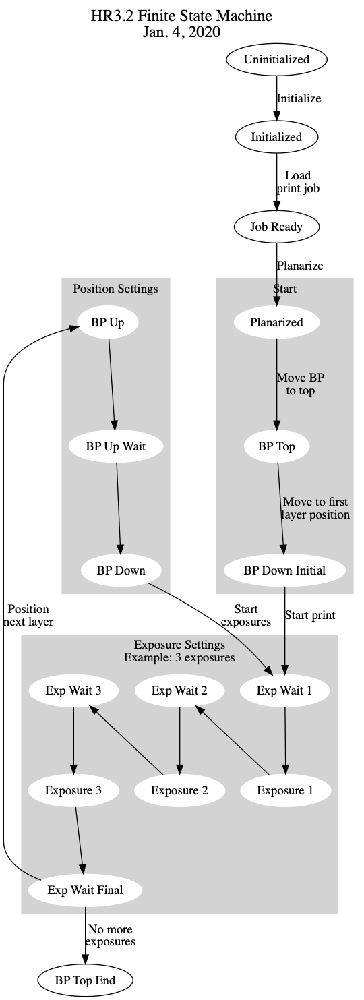

# Nordin Group - 3D Printer Print File Specification

The purpose of this repository is to document a JSON-based file standard for conveying 3D print information to a Digital Light Processing Stereolithography (DLP-SL) 3D printer for how to run a print job. This is the file format used by the custom 3D printers developed in the Nordin Group at Brigham Young University (BYU), and is intended as a general standard that can be used in industry and academia. 

Traditionally DLP-SL 3D printers only expose a single image per layer, and have the same layer thickness for each layer. Print files that follow the format we outline in this repository allow each layer to be comprised of multiple images, with the ability to customize the exposure time for each image, as well as customizing each layer's thickness.

Overall, following this file standard gives a much higher degree of control over how a design is printed compared to traditional 3D printing methods.


# Standard for Print Job

A print job is composed of two parts: (1) a JSON file that follows the specification in this README, and (2) a directory with all of the png images that define what is to be printed. In our implementation, both of these parts are compressed into a single zip file which is uploaded to the printer. The zip file is typically organized as follows:

```
    .  
    ├── print_settings.json  
    └── slices  
        ├── 0000.png  
        ├── 0001.png  
        ├── 0002.png  
        └── 0003.png  
            .  
            .  
            .  
```

## Definitions

`Layer`: everything that happens after finishing the last exposure for the previous layer and the last exposure for the current layer.

This involves two sets of operations controlled by the following settings:
`Position Settings`: move build platform up, an optional wait if specified, and move build platform down the same amount as it moved up minus the layer thickness.
`Exposure Settings`: a series of optional waits and mandatory exposures, one exposure for each image for the current layer.

## Finite State Machine View of 3D Printer Operation




## JSON File

Time units are milliseconds.
Layer thickness is in microns.
All other distance, velocity, and acceleration units are mm, mm/s, and mm/s<sup>2</sup>.

## Minimal format

The following JSON file represent the minimal content to specify a 3D print. **ALL FIELDS ARE REQUIRED.**

### JSON

For this minimal case, **all layers have the same position and exposure parameters**, i.e., those specified in `Default layer settings`. Only 6 layers are included to avoid using too much space to illustrate the idea.

    {
        "Header": {
            "Schema version": "0.2",
            "Image directory": "slices"
        },
        "Default layer settings": {
            "Number of duplications": 1,
            "Position settings": {
                "Layer thickness (um)": 10,
                "Distance up (mm)": 1.0,
                "Initial wait (ms)": 100.0,
                "BP up speed (mm/sec)": 25.0,
                "BP up acceleration (mm/sec^2)": 50.0,
                "Up wait (ms)": 0,
                "BP down speed (mm/sec)": 20.0,
                "BP down acceleration (mm/sec^2)": 50.0,
                "Final wait (ms)": 0
            },
            "Image settings": {
                "Image file": "0000.png",
                "Layer exposure time (ms)": 550,
                "Light engine power setting": 100,
                "Relative focus position (um)": 0,
                "Wait before exposure (ms)": 0,
                "Wait after exposure (ms)": 0
            }
        },
        "Layers": [
            {
                "Image settings list": [
                    {
                        "Image file": "0001.png"
                    }
                ]
            },
            {
                "Image settings list": [
                    {
                        "Image file": "0002.png"
                    }
                ]
            },
            {
                "Image settings list": [
                    {
                        "Image file": "0003.png"
                    }
                ]
            },
            {
                "Image settings list": [
                    {
                        "Image file": "0004.png"
                    }
                ]
            },
            {
                "Image settings list": [
                    {
                        "Image file": "0005.png"
                    }
                ]
            },
            {
                "Image settings list": [
                    {
                        "Image file": "0006.png"
                    }
                ]
            }
        ]
    }

### Minimal JSON layer object

The minimal information needed for an individual layer in the `Layers` list is an empty Layer object, in which case the default image will be used for the layer exposure:

    # Layer settings object
    {
        # List of Image settings, 1 for each image in the layer
        "Image settings list": [
            # Image settings for first image
            {}
        ]
    }

Or, flattening the JSON Layer object:

    {"Image settings list": [{}]}

## General format - selectively override default settings

The general principle is that the default layer settings are used for each layer except where they are overridden. For a given layer, any additional parameters provided beyond the minimal JSON layer object above will override the corresponding default layer settings. An example is shown below.

Note: A `"Comment"` tag can be put into any object and it will be ignored.

    {
        "Header": {
            "Schema version": "0.2",
            "Image directory": "slices"
        },
        "Default layer settings": {
            "Number of duplications": 1,
            "Position settings": {
                "Layer thickness (um)": 10,
                "Distance up (mm)": 1.0,
                "Initial wait (ms)": 100.0,
                "BP up speed (mm/sec)": 25.0,
                "BP up acceleration (mm/sec^2)": 50.0,
                "Up wait (ms)": 0,
                "BP down speed (mm/sec)": 20.0,
                "BP down acceleration (mm/sec^2)": 50.0,
                "Final wait (ms)": 0
            },
            "Image settings": {
                "Image file": "default_image.png",
                "Layer exposure time (ms)": 550,
                "Light engine power setting": 100,
                "Relative focus position (um)": 0,
                "Wait before exposure (ms)": 0,
                "Wait after exposure (ms)": 0
            }
        },
        "Layers": [
            {
                "Comment": "Override layer thickness, up distance, & exposure time",
                "Position settings": {
                    "Layer thickness (um)": 3.3,
                    "Distance up (mm)": 1.2
                },
                "Image settings list": [
                    {
                        "Image file": "0000.png",
                        "Layer exposure time (ms)": 20000
                    }
                ]
            },
            {
                "Comment": "Override exposure time",
                "Image settings list": [
                    {
                        "Image file": "0001.png",
                        "Layer exposure time (ms)": 5000
                    }
                ]
            },
            {
                "Comment": "Override number of duplications",
                "Number of duplications": 50,
                "Image settings list": [
                    {
                        "Image file": "0002.png"
                    }
                ]
            },
            {
                "Comment": "Use 4 images for this layer, each with their own exposure time",
                "Image settings list": [
                    {
                        "Image file": "0053.png",
                        "Layer exposure time (ms)": 400,
                    },
                    {
                        "Image file": "0053a.png",
                        "Layer exposure time (ms)": 200,
                    },
                    {
                        "Image file": "0053b.png",
                        "Layer exposure time (ms)": 100,
                    },
                    {
                        "Image file": "0053c.png",
                        "Layer exposure time (ms)": 200,
                    }
                ]
            },
            {
                "Comment": "Break 10 um layer into a 5 um layer for one image followed by another 5 um layer everywhere else for the next images. The first 5 um layer could cover only a small area of the projected image while the next 5 um layer could have one or more images that cover much or all of the rest of the image area in which case those regions are actually a 10 um layer because the first 5 um layer did not polymerize any resin there.",
                "Position settings": {
                    "Layer thickness (um)": 5
                },
                "Image settings list": [
                    {
                        "Image file": "0054a.png",
                        "Layer exposure time (ms)": 200
                    }
                ]
            },
            {
                "Comment": "Second 5 um layer",
                "Position settings": {
                    "Layer thickness (um)": 5
                },
                "Image settings list": [
                    {
                        "Image file": "0054.png",
                        "Layer exposure time (ms)": 400
                    },
                    {
                        "Image file": "0054b.png",
                        "Layer exposure time (ms)": 200
                    },
                    {
                        "Image file": "0054c.png",
                        "Layer exposure time (ms)": 275
                    }
                ]
            },
            {
                "Image settings list": [
                    {
                        "Image file": "0055.png"
                    }
                ]
            },
            {
                "Image settings list": [
                    {
                        "Image file": "0056.png"
                    }
                ]
            },
            {
                "Image settings list": [
                    {
                        "Image file": "0057.png"
                    }
                ]
            },
            {
                "Image settings list": [
                    {
                        "Image file": "0058.png"
                    }
                ]
            },
            {
                "Image settings list": [
                    {
                        "Image file": "0059.png"
                    }
                ]
            },
            {
                "Comment": "Override number of duplications",
                "Number of duplications": 20,
                "Image settings list": [
                    {
                        "Image file": "0060.png"
                    }
                ]
            }
        ]
    }


<a rel="license" href="http://creativecommons.org/licenses/by/4.0/"></a><br />This work is  licensed under a <a rel="license" href="http://creativecommons.org/licenses/by/4.0/">Creative Commons Attribution 4.0 International License</a>.
